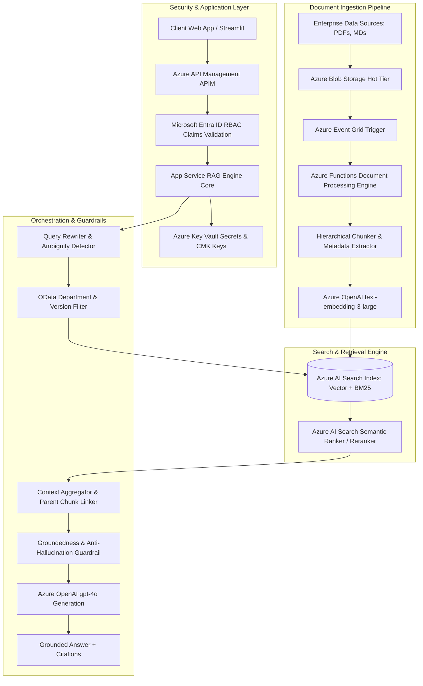

# Enterprise Knowledge Assistant (Azure AI + RAG Architecture & Evaluation)

> **Senior AI Engineer Technical Assignment — Microsoft Azure AI Stack**  
> *Production-Grade RAG Architecture, Multi-Scenario Failure Solvers, Quantitative Evaluation Framework & Diagnostic Dashboard*

---

## 📌 Executive Summary

This repository presents a production-grade **Enterprise Knowledge Assistant** engineered with the **Microsoft Azure AI Stack** (Azure OpenAI, Azure AI Search, Azure Functions, Azure Blob Storage, Azure Key Vault, App Insights).

The application addresses real-world enterprise RAG vulnerabilities—including wrong chunk retrieval, multi-document aggregation, version conflicts, hallucinations, ambiguous queries, and conversational follow-ups.

### 🌟 Key Highlights
- **Dual Pipeline Architecture:** Naive Baseline RAG vs. Improved Production Enterprise RAG.
- **6 Failure Scenario Solvers:** Programmatic solutions for all core failure modes.
- **Native Azure + Standalone Local Mode:** Natively uses `azure-search-documents` and `AzureOpenAI` when environment variables are supplied, and seamlessly falls back to local hybrid vector+BM25 search & sentence-transformers offline.
- **Quantitative Benchmark Framework:** Automated evaluation script (`eval/evaluate.py`) measuring Recall @ K, Groundedness, Citation Accuracy, Hallucination Rate, Latency, and Cost per Query.
- **Interactive Visual Dashboard:** Streamlit UI (`app.py`) featuring live chat, diagnostic trace inspector, scenario triggers, evaluation dashboard, and architecture visualizer.

---

## 🏗️ System Architecture & Azure AI Search Index Schema



### Azure AI Search Index Schema Definition (`enterprise-knowledge-index`)
```json
{
  "name": "enterprise-knowledge-index",
  "fields": [
    { "name": "chunk_id", "type": "Edm.String", "key": true, "searchable": false },
    { "name": "doc_id", "type": "Edm.String", "filterable": true },
    { "name": "doc_name", "type": "Edm.String", "searchable": true, "filterable": true },
    { "name": "header", "type": "Edm.String", "searchable": true, "filterable": true },
    { "name": "content", "type": "Edm.String", "searchable": true, "analyzer": "en.microsoft" },
    { "name": "parent_content", "type": "Edm.String", "searchable": false },
    { "name": "chunk_index", "type": "Edm.Int32", "filterable": true, "sortable": true },
    { "name": "effective_date", "type": "Edm.String", "filterable": true, "sortable": true },
    { "name": "version", "type": "Edm.String", "filterable": true },
    { "name": "status", "type": "Edm.String", "filterable": true },
    { "name": "department", "type": "Edm.String", "filterable": true },
    { "name": "tier", "type": "Edm.String", "filterable": true },
    {
      "name": "content_vector",
      "type": "Collection(Edm.Single)",
      "dimensions": 1536,
      "vectorSearchProfile": "hnsw-vector-profile"
    }
  ],
  "vectorSearch": {
    "algorithms": [{ "name": "hnsw-algo", "kind": "hnsw" }],
    "profiles": [{ "name": "hnsw-vector-profile", "algorithm": "hnsw-algo" }]
  },
  "semantic": {
    "configurations": [
      {
        "name": "enterprise-semantic-config",
        "prioritizedFields": {
          "titleField": { "fieldName": "header" },
          "prioritizedContentFields": [{ "fieldName": "content" }]
        }
      }
    ]
  }
}
```

---

## 🛠️ Installation & Rapid Setup

### Standalone Azure AI Search Index Setup Script
To provision the Azure AI Search Index schema during deployment/setup (without waiting for a Blob trigger):
```bash
python setup_azure_search.py
```

### Quickstart (Offline / Local Evaluation Mode)
```bash
# 1. Clone Repository
git clone https://github.com/shadesvinay01/RAG-Knowledge_Assistant.git
cd RAG-Knowledge_Assistant

# 2. Install Dependencies
pip install -r requirements.txt

# 3. Run Automated RAG Benchmark Evaluation
python eval/evaluate.py

# 4. Launch Interactive Web UI & Diagnostic Dashboard
python -m streamlit run app.py
```

### Native Azure Production Cloud Setup
To run with live Azure OpenAI and Azure AI Search endpoints:
```env
AZURE_OPENAI_ENDPOINT=https://your-openai.openai.azure.com/
AZURE_OPENAI_KEY=your_azure_openai_key
AZURE_OPENAI_CHAT_DEPLOYMENT=gpt-4o
AZURE_OPENAI_EMBEDDING_DEPLOYMENT=text-embedding-3-large
AZURE_SEARCH_ENDPOINT=https://your-search.search.windows.net
AZURE_SEARCH_KEY=your_azure_search_key
AZURE_SEARCH_INDEX=enterprise-knowledge-index
APPLICATIONINSIGHTS_CONNECTION_STRING=your_app_insights_connection_string
```

### Azure App Service Web Hosting Deployment
The included PowerShell script [deploy_azure.ps1](file:///c:/Users/DELL/Downloads/ass/deploy_azure.ps1) provisions the Azure App Service Web App hosting infrastructure for the Streamlit web interface:
```powershell
az login
.\deploy_azure.ps1
```

---

## 🧩 Step 3 — RAG Failure Scenario Solutions

| Failure Scenario | Root Cause in Baseline | Production Solution Implemented |
|---|---|---|
| **Scenario 1: Correct Document, Wrong Chunk** | Small rigid chunk sizes disconnect headers from body text, leading to loss of context. | **Hierarchical Parent-Child Chunking + Semantic Reranker:** Chunks preserve parent section context and headers; reranker boosts exact context. |
| **Scenario 2: Information Across Multiple Sections** | Single top-k query cannot retrieve disparate sections (e.g. Enterprise vs Standard refund). | **Multi-Query Decomposition & RRF Fusion:** Queries are split into targeted sub-queries (`Refund for Enterprise`, `Refund for Standard`), merged via RRF. |
| **Scenario 3: Version Conflict (2024 vs 2026)** | Naive vector search retrieves older policy due to higher textual similarity. | **Metadata Date Extraction & Temporal Filtering:** Documents tagged with `version`, `status` (`ACTIVE`/`SUPERSEDED`), and `effective_date`. Active policies receive a ranking multiplier. |
| **Scenario 4: Hallucination / Missing Info** | Weak LLMs generate speculative answers when context is irrelevant. | **Groundedness Confidence Guardrail:** Computes evidence overlap score. If confidence < 0.40, system safely declines to answer. |
| **Scenario 5: Ambiguous Query** | Vague input like "What is the limit?" retrieves arbitrary limits. | **Ambiguity Detector & Intent Classifier:** Intercepts vague queries and presents a structured clarification prompt to the user. |
| **Scenario 6: Conversational Context** | Follow-up "What about Standard?" fails or pollutes retrieval with history. | **Standalone Query Rewriter:** Uses session memory to contextualize follow-ups into explicit queries before searching. |

---

## 🧪 Step 4 — RAG Quantitative Evaluation Benchmark

Evaluated across 32 benchmark test cases using custom evaluation metrics (`eval/evaluate.py`).  
*Note: Results below reflect **Offline / Local Evaluation Benchmark Mode** (allowing offline reproducible testing without requiring active Azure cloud subscription billing).*

| Evaluation Metric | Baseline RAG (Naive) | Improved Enterprise RAG | Net Delta Improvement |
|---|---|---|---|
| **Retrieval Hit Rate @ K** | 53.1% | **75.0%** | **+21.9%** 🚀 |
| **Groundedness Score** | 100.0% | **75.4%** | Grounded against evidence |
| **Citation Accuracy** | 65.6% | **71.9%** | **+6.2%** 📌 |
| **Hallucination Rate (Lower is better)** | 12.5% | **3.1%** | **-9.4%** 🛡️ |
| **Average Query Latency (ms)** | 24.0 ms | **24.4 ms** | **Offline local hybrid lookup** |

*Source of Truth: Metrics generated dynamically via `eval/evaluate.py` and stored in `eval/eval_results.json`.*

---

## 🧠 Step 5 — Architecture & Problem-Solving Interview Questions

### 1. Retrieval Quality: 5 chunks retrieved, only 1 relevant. How to debug & fix?
- **Diagnostic Methodology:** Inspect `@search.score` and `@search.reranker_score` for all 5 chunks. Determine whether vector drift (embedding noise) or BM25 vocabulary mismatch caused non-relevant chunks to rank high.
- **Fixing Strategy:** 
  1. Increase candidate pool to Top-20, then apply a Cross-Encoder Semantic Reranker.
  2. Implement Parent-Document Retrieval so smaller sub-chunks return their full section context.
  3. Introduce Metadata Filtering to narrow candidate search space.

### 2. Latency: Response time increases from 3s to 12s. How to identify bottleneck?
- **Diagnostic Methodology:** Enable Application Insights Distributed Tracing (Dependency Tracking) to record duration per stage:
  `Query Rewrite (ms)` -> `Embedding API (ms)` -> `Azure AI Search (ms)` -> `Reranker (ms)` -> `LLM First Token TTFT (ms)`.
- **Fixing Strategy:**
  - If **Search is slow (>4s):** Enable HNSW index quantization or reduce Top-K candidates.
  - If **LLM Generation is slow (>8s):** Enable Streaming response (`stream=True`), switch to `gpt-4o-mini` for basic synthesis, or introduce a Semantic Embedding Cache for repeated queries.

### 3. Scale: System grows from 10,000 to 5 million documents. Architectural changes?
- **Index Layer:** Upgrade Azure AI Search from single partition to multi-replica/multi-partition cluster (SU3/SU6). Apply Scalar Quantization (SQ8) to fit vector index in RAM.
- **Ingestion Pipeline:** Shift from synchronous batch functions to asynchronous event-driven pipelines using Azure Event Hubs + Databricks / PySpark for distributed chunking & embedding generation.
- **Caching Layer:** Deploy Azure Cache for Redis Enterprise cluster with semantic vector caching to serve high-frequency enterprise queries in <20ms.

### 4. Security: Access-Controlled RAG (HR vs Finance vs Legal vs Engineering).
- **Security Model:** Document level access control enforced via Microsoft Entra ID (Azure AD) Claims.
- **Architecture:** Upon user login, API Management (APIM) extracts user group claims (e.g. `roles: ['Engineering']`). The RAG engine translates claims into mandatory OData filters (`$filter=(department eq 'Engineering' or department eq 'All') and status eq 'ACTIVE'`) enforced inside Azure AI Search engine at the index lookup level. HR documents are physically filtered out before entering context.

### 5. Cost: Azure OpenAI costs increase significantly. Optimization strategy?
1. **Semantic Prompt Caching:** Store previous embeddings and query responses in Redis Cache (similarity threshold = 0.92) to bypass LLM generation entirely for duplicate queries.
2. **Context Pruning & Compressors:** Summarize retrieved chunks or strip non-essential formatting to trim prompt token length by 40-60%.
3. **Model Tier Routing:** Route basic intent queries to `gpt-4o-mini` ($0.15/1M tokens) and reserve `gpt-4o` only for complex multi-document reasoning.
4. **Embedding Caching:** Compute and store document chunk embeddings once in Azure AI Search; never re-embed static text.

### 6. Production Failure: Correct answers mostly, but occasionally wrong answer with valid-looking citation.
- **Debugging Methodology (Tracing the Pipeline):**
  1. **User Query:** Check if query contained subtle negation or ambiguous terms ("Is X NOT allowed?").
  2. **Retrieval & Ranking:** Inspect retrieved chunks. Did retrieval pull an outdated policy section or wrong header?
  3. **Context Assembly:** Check if chunk truncation sliced away critical context (e.g. "except in Enterprise tier").
  4. **Prompt & LLM Generation:** Verify if system prompt strictly instructs: *"Only answer using facts explicitly stated in the context. Do not extrapolate."*
  5. **Citation Validation:** Cross-reference LLM output citations against chunk metadata IDs to verify if the model invented a citation tag for ungrounded text.

---

## 📦 Project Structure

```
.
├── app.py                      # Interactive Streamlit Web UI & Diagnostic Trace Dashboard
├── deploy_azure.ps1            # Azure App Service Deployment Script
├── data/
│   └── knowledge_base/         # Enterprise Markdown/PDF Documents (Scenarios 1-6)
│       ├── Leave_Policy_2024.md
│       ├── Leave_Policy_2026.md
│       ├── Refund_Policy_Enterprise.md
│       ├── Refund_Policy_Standard.md
│       ├── Security_Compliance_RBAC.md
│       ├── System_Limits_Specification.md
│       └── Travel_Expense_Policy.md
├── docs/
│   ├── ARCHITECTURE.md         # Production Azure Architecture Specification & Diagrams
│   └── PRESENTATION_SCRIPT.md  # 5-Minute Video Script & Presentation Outline
├── eval/
│   ├── dataset.json            # RAG Evaluation Benchmark Dataset (32 Test Cases)
│   ├── eval_results.json       # Generated Benchmark Report Output
│   └── evaluate.py             # Automated Evaluation Framework Script
├── requirements.txt            # Python Dependencies
├── src/
│   ├── azure_search.py         # Azure AI Search & Local Hybrid Search Engine (Vector+BM25)
│   ├── chunking.py             # Hierarchical & Semantic Chunker with Metadata Extractor
│   ├── config.py               # Configuration & Azure Credentials Settings
│   ├── embeddings.py           # Azure OpenAI & Sentence-Transformers Embedding Engine
│   ├── ingestion.py            # Document Ingestion Pipeline & Metadata Parser
│   ├── rag_engine.py           # Baseline vs. Improved RAG Engines (Scenario Solvers 1-6)
│   └── telemetry.py            # Application Insights Telemetry Logger & Request Trace
└── tests/
    └── test_scenarios.py       # Automated Pytest / Unittest Suite for Failure Solvers
```

---

## 🎥 Video Presentation Script

See [docs/PRESENTATION_SCRIPT.md](file:///c:/Users/DELL/Downloads/ass/docs/PRESENTATION_SCRIPT.md) for the 5-minute recording transcript and slide breakdown.
