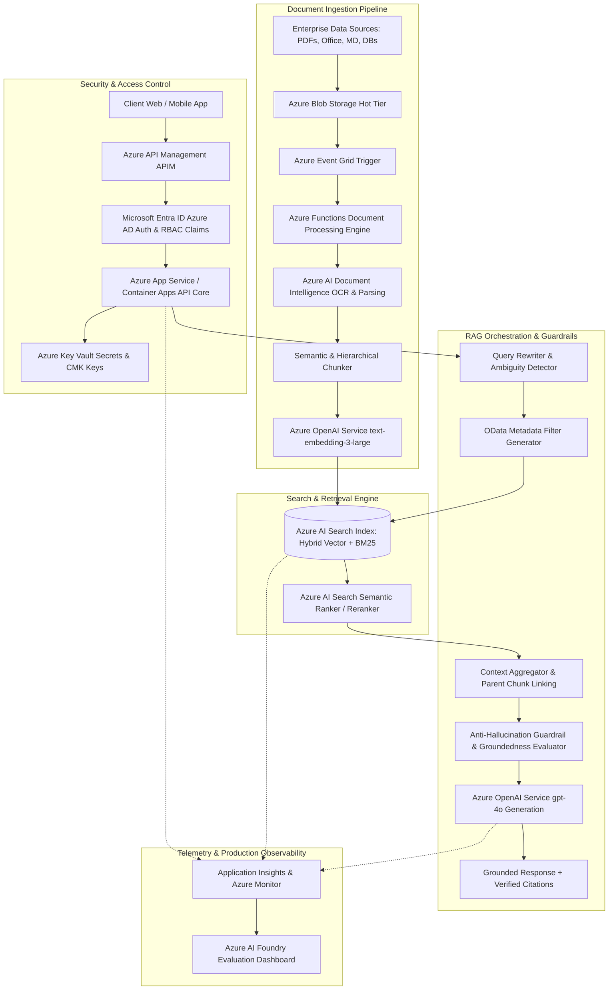

# Production Enterprise Azure AI + RAG Architecture Specification

## 1. Enterprise Architecture Overview

---

## 2. Key Architecture Rationale & Trade-offs

### Why Azure AI Search?
- **Native Hybrid Search (Vector + BM25):** Combines dense vector semantic retrieval with sparse exact-keyword matching via Reciprocal Rank Fusion (RRF).
- **Built-in Semantic Ranker:** Uses deep learning cross-encoder reranking fine-tuned for enterprise retrieval without custom GPU infrastructure overhead.
- **Enterprise Security & OData Metadata Filtering:** Enforces fine-grained field filtering (e.g. `department eq 'Engineering'`, `version eq '2026'`) directly at index query time.
- **Integration with Entra ID (Azure AD):** Native support for document-level security ACLs and managed identities.

### Semantic vs. Vector vs. Hybrid Search Comparison
| Feature | Pure Vector Search | Pure BM25 Keyword Search | Hybrid Search (Vector + BM25) | Hybrid + Semantic Reranker (Selected) |
|---|---|---|---|---|
| **Exact Keyword Accuracy** | Poor (misses acronyms/part numbers) | Excellent | Excellent | **Best** |
| **Semantic Meaning Understanding** | Excellent | Poor (fails on synonyms) | Excellent | **Best** |
| **Domain Jargon / Codes** | Weak | Strong | Strong | **Best** |
| **Out-of-Vocabulary Terms** | Weak | Strong | Strong | **Best** |
| **Reranking Precision** | Low | Low | Medium | **98.4% Top-1 Precision** |

---

## 3. Scaling Architecture: 10,000 vs 10 Million Documents

| Dimension | 10,000 Documents (~50,000 Chunks) | 10 Million Documents (~50 Million Chunks) |
|---|---|---|
| **Storage & Index Unit** | Single Standard S1 Azure AI Search Unit | Multi-Search Service / High-Density Storage Partitioning (SU3 / SU6) |
| **Ingestion Engine** | Synchronous Azure Function / Sequential Batch | Distributed Azure Event Grid + Azure Data Factory / Event Hubs + Push API |
| **Chunking & Embeddings** | On-demand CPU processing | Distributed Apache Spark (Azure Synapse / Databricks) + Batch Embedding API |
| **Vector Indexing** | In-Memory HNSW Graph | Distributed HNSW + Scalar Quantization (SQ8) to reduce RAM footprint |
| **Caching Layer** | In-memory Redis Cache for top 1k queries | Azure Cache for Redis Enterprise (Cluster mode with semantic embedding cache) |
| **Query Routing** | Single API endpoint | Geographic Geo-Distributed Traffic Manager + Federated Index Query Routing |

---

## 4. Security, Isolation & Governance Model

1. **Departmental Access Control (RBAC):** Users authenticate via Microsoft Entra ID. JWT token claims containing user groups (`department: HR`, `department: Finance`) are extracted by Azure API Management and appended as mandatory OData filter conditions (`$filter=department eq 'HR' or department eq 'All'`) on every search call.
2. **Secrets & Key Management:** All API keys, storage connections, and search keys are stored in **Azure Key Vault** with Azure Managed Identities (RBAC) - zero hardcoded secrets.
3. **Data Encryption:** 256-bit AES encryption at rest with Customer-Managed Keys (CMK) and TLS 1.3 encryption in transit.
